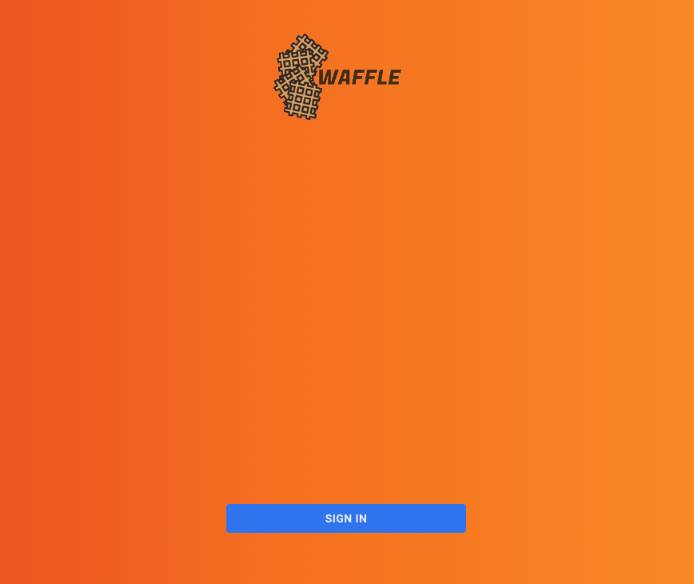

Waffle Social Media Platform
============

Group 1's (Hackson 5) solution to the design challenge of "something which allows people to share and celebrate their culture".

Waffle is a social media network purely centered around people's culture. You can easily fear being different or standing out when posting things about your own culture on social media today, whether that be delicious food, a cultural event you have been to or even music.

Waffle is a platform where you can celebrate your culture with others. Our map feature allows you to easily explore traditions from countries around the world. By clicking on a country, you are able to see posts related to its culture.

Instructions on how to run the app
----

Download Node.js / npm package manager if you do not already have them installed locally. https://nodejs.org/en/download/

Run:

    node -v
    npm -v

The versions of node and npm which you have installed locally should be returned if the installation process was successful.

### Globe Backend

Navigate to the `globe-backend` folder

    cd app-backend

If you do not have nodemon installed, run:
    
    npm i nodemon

To run the backend server:

    nodemon server.js

You should see a message like:

    p-backend % nodemon server.js
    [nodemon] 2.0.20
    [nodemon] to restart at any time, enter `rs`
    [nodemon] watching path(s): *.*
    [nodemon] watching extensions: js,mjs,json
    [nodemon] starting `node server.js`
    Listening on localhost: 9000
    DB Connected for pusher
    DB Connected

which means that the backend has started up successfully and is now listening on port 9000.

### App Frontend

In a new terminal window, navigate to the `app-frontend` folder

Try the command `npm start`, if successful you should see a login screen like this at `http://localhost:3000/`:

and the following returned in terminal:

    Compiled successfully!

    You can now view popular-social-frontend in the browser.

     Local:            http://localhost:3000
     On Your Network:  http://192.168.1.191:3000

    webpack compiled successfully

Else try the following commands:

    npm install
    npm run build
    npm start

### Globe Frontend

Navigate to the `globe-frontend` folder

    cd globe-frontend

Open `globe.html`

Congratulations! You have the web app running and you should be able to navigate between countries to explore cultures from all around the world.